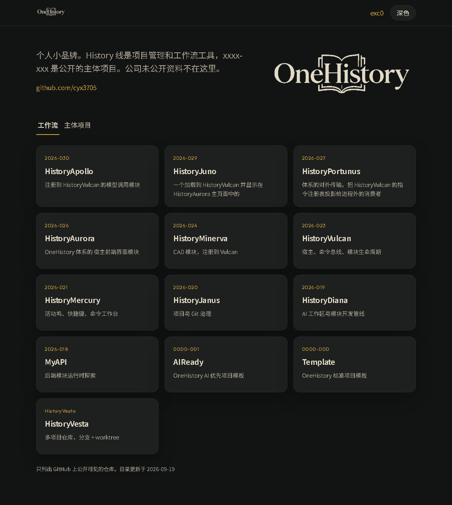

# OneHistorySite

> OneHistory 公开项目目录站，内容由各项目仓库的 README 自动生成

## 项目效果图



## 项目内容

对外站点 `onehistory.exc0.top` 的源码与生成管线。站点上每一张项目卡片、每一个说明页，都是从 GitHub 上各个**有编号的公开仓库**的 `README.md` 里读出来的，不手工维护内容。

### 目录结构

| 路径 | 说明 |
| --- | --- |
| `b-Site/index.template.html` | 首页模板，`/*__TOOLS__*/` 等占位符由脚本填充 |
| `b-Site/p.template.html` | 项目说明页模板 |
| `b-Site/assets/` | 样式、脚本、图标（手工维护） |
| `b-Site/CNAME` | 自定义域名 `onehistory.exc0.top` |
| `b-Site/index.html` | **生成产物**，勿手改 |
| `b-Site/p/<仓库名>/index.html` | **生成产物**，每个项目一页 |
| `b-Site/projects.json` | **生成产物**，结构化数据 |
| `b-Code/build.mjs` | 生成脚本 |
| `b-Code/site.config.json` | 配置：收录规则、页签归类、人工覆盖 |

### 数据从哪来

脚本读的是**标准项目模型**约定的两个字段：

```markdown
# 项目全称          ← 卡片标题
> 一句话描述        ← 卡片副标题
```

README 正文整体渲染成该项目的说明页，其中的相对路径图片会重写到 `raw.githubusercontent.com`，相对链接重写到仓库的 blob 页。

**所以：想改站点上某个项目的名称或描述，去改那个项目仓库的 README，不要改这里。**

### 配额说明

- 仓库列表走 `api.github.com`，**每次构建仅 1 次请求**
- 每个项目的 README 走 `raw.githubusercontent.com`，属于 CDN，**不计入 API 限额**

因此项目数量增长不会触发限速。Actions 中还会带上 `GITHUB_TOKEN`，限额进一步提到 5000/小时。

### 人工覆盖

`b-Code/site.config.json` 的 `overrides` 只在两种情况下使用：

1. 该仓库 README 仍是模板占位，解析不出内容；
2. README 标题适合做文档标题，但太长不适合做卡片标题。

**把对应仓库的 README 写好之后，删掉该条覆盖即可恢复全自动。** 构建时会把仍是模板占位的仓库列在日志里。

### 本地构建

```bash
npm install
npm run build      # 生成 b-Site/index.html、p/**、projects.json
npm run dry        # 只抓取和解析，不写文件
```

### 自动发布

`.github/workflows/build-site.yml`：

- 每天 UTC 20:00（北京时间 04:00）刷新一次
- 改模板/脚本/样式后 push 立即重建
- 也可在 Actions 页面手动触发
- 生成结果提交回 `main`（**只提交有差异的部分**），随后发布到 GitHub Pages

## 保留内容

- 本模板项目介绍：此为最初的准备的项目模板
    每个分支项目都会由他去继承
- 作者：Pinavia - 2025


